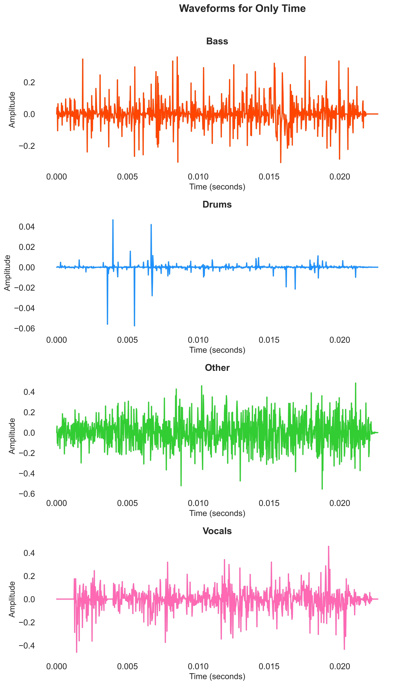

Technical Report: Theories, Algorithms, and Models in Audio Stem Separation
==========================================================================

1. Introduction
---------------

Audio stem separation, also known as music source separation, is a key task in audio processing that involves isolating individual components (stems) from a mixed audio signal, such as separating vocals, drums, bass, and other instruments from a song. This report focuses on the theories, algorithms, and models underlying modern stem separation systems, particularly those based on the Demucs family of models, as used in libraries like torchaudio and audio-separator. The information is drawn from official documentation, research papers, and project repositories related to Demucs and its variants.
The stem separation code in question utilizes HDemucs models from torchaudio (for 4-stem separation) and audio-separator (which wraps Demucs models for flexible 4- or 6-stem separation). These models leverage deep learning to achieve high-fidelity separation, outperforming earlier approaches like Spleeter.

2. Theories in Audio Stem Separation
------------------------------------

Audio stem separation is grounded in signal processing and machine learning theories:

2.1 Time-Frequency Representation
~~~~~~~~~~~~~~~~~~~~~~~~~~~~~~~~~

*   Short-Time Fourier Transform (STFT): Audio signals are transformed from the time domain to the time-frequency domain using STFT to represent the signal as a spectrogram (magnitude and phase). This allows models to analyze frequency content over time, essential for distinguishing sources like vocals (high frequencies) from bass (low frequencies).

*   Hybrid Domain Processing: Modern models like Demucs combine time-domain (waveform) and frequency-domain (spectrogram) processing. Waveform processing preserves phase information for high-fidelity reconstruction, while spectrogram processing captures perceptual features.

2.2 Source Separation Principles
~~~~~~~~~~~~~~~~~~~~~~~~~~~~~~~~

*   Blind Source Separation (BSS): The task is a form of BSS, where sources are separated without prior knowledge of the mixing process. Theories like Independent Component Analysis (ICA) inspired early methods, but deep learning has superseded them for music due to complex mixing.

*   Masking in Frequency Domain: Models estimate masks for each source in the spectrogram, multiplying the mixed spectrogram to isolate components, followed by inverse STFT for reconstruction.

2.3 Deep Learning Foundations
~~~~~~~~~~~~~~~~~~~~~~~~~~~~~

*   U-Net Architecture: Inspired by Wave-U-Net, models use encoder-decoder structures with skip connections to preserve fine-grained details during downsampling and upsampling.
*   Transformer Integration: Attention mechanisms (self-attention and cross-attention) allow models to focus on relevant parts of the input across domains, improving long-range dependencies in audio sequences.

3. Algorithms
-------------

The algorithms in Demucs and HDemucs involve end-to-end deep learning pipelines:

3.1 Encoder-Decoder Framework
~~~~~~~~~~~~~~~~~~~~~~~~~~~~~

*   Demucs Algorithm: Processes raw waveforms using a U-Net-like convolutional architecture. The encoder compresses the input through convolutions, and the decoder reconstructs separated sources. Skip connections fuse features from encoder to decoder.
*   Hybrid Processing: In Hybrid Demucs (v3), the algorithm operates in both waveform and spectrogram domains. It uses STFT to convert to spectrogram, processes in parallel, and fuses outputs for reconstruction.
*   Transformer Enhancement: In Hybrid Transformer Demucs (v4), innermost layers are replaced with a cross-domain Transformer Encoder. Self-attention is applied within each domain (waveform/spectrogram), and cross-attention merges them. Sparse attention kernels extend the receptive field for better context.

3.2 Training Algorithms
~~~~~~~~~~~~~~~~~~~~~~~

*   Loss Function: Mean Squared Error (MSE) or L1 loss on waveforms, often combined with multi-scale spectrogram loss to optimize for perceptual quality.
*   Fine-Tuning: Per-source fine-tuning refines the model for specific stems, improving SDR by ~0.2 dB.
*   Data Augmentation: Pitch shifting, time stretching, and mixing to simulate real-world variations.

3.3 Inference
~~~~~~~~~~~~~

*   Separation Process: Input audio is processed through the model to output multi-channel waveforms (one per stem). For audio-separator, it wraps this with format conversion and batch processing.

4. Models
---------

The code uses variants from the Demucs family:

4.1 Demucs Models (via audio-separator)
~~~~~~~~~~~~~~~~~~~~~~~~~~~~~~~~~~~~~~~

*   htdemucs: Hybrid Transformer Demucs (v4), 4 stems (drums, bass, other, vocals). Architecture: U-Net with Transformer encoder for cross-domain attention.
*   htdemucs_ft: Fine-tuned version of htdemucs, slower inference but higher quality.
*   htdemucs_6s: 6-stem variant (adds piano, guitar). Experimental, with noted artifacts in piano separation.
*   hdemucs_mmi: Hybrid Demucs (v3), retrained on extended dataset, baseline for v4.

4.2 HDemucs in torchaudio
~~~~~~~~~~~~~~~~~~~~~~~~~

*   HDEMUCS_HIGH_MUSDB_PLUS: Pre-trained on MUSDB-HQ + 150 extra songs, 4 stems. Hybrid architecture for high-fidelity separation.
*   HDEMUCS_HIGH_MUSDB: Trained only on MUSDB-HQ training set.
*   Relation to Demucs: HDemucs is a hybrid extension of Demucs, optimized for music source separation in torchaudio pipelines.

4.3 Audio-Separator Wrapper
~~~~~~~~~~~~~~~~~~~~~~~~~~~

*   Audio-separator uses Demucs models (e.g., htdemucs_6s) for inference, supporting common audio formats and GPU/CPU acceleration. It loads YAML configurations for models, enabling 4- or 6-stem separation without custom architecture details.

5. Training and Performance
---------------------------

*   Datasets: MUSDB-HQ (150 songs) for benchmark, extended with 800 internal songs for better generalization.
*   Performance Metrics: Signal-to-Distortion Ratio (SDR). HT Demucs achieves 9.0 dB (fine-tuned 9.2 dB) on MUSDB-HQ test set, outperforming Wave-U-Net (5.3 dB) and Spleeter (5.9 dB).
*   Comparison: Demucs excels in time-domain processing for artifact-free outputs, unlike frequency-only models.

6. Conclusion
-------------

Demucs and HDemucs represent advanced audio stem separation, combining U-Net, hybrid domains, and Transformers for state-of-the-art results. The code leverages these for practical use, with torchaudio for simplicity and audio-separator for flexibility. Future improvements could include real-time processing or more stems.

References
-----------

*   Défossez, A. (2021). Hybrid Spectrogram and Waveform Source Separation.
*   Rouard, S., et al. (2023). Hybrid Transformers for Music Source Separation.

Appendix
----------

Comparison of Spectrograms
~~~~~~~~~~~~~~~~~~~~~~~~~~

.. raw:: html

    <table align="center">
      <tr>
        <td>audio-separator htdemucs_6s</td>
        <td>audio-separator htdemucs_ft</td>
        <td>torchaudio hdemucs_high</td>
      </tr>
    </table>

Comparison of Waveforms
~~~~~~~~~~~~~~~~~~~~~~~

   Waveforms for audio-separator htdemucs_6s.

   Waveforms for audio-separator htdemucs_ft.

   Waveforms for torchaudio hdemucs_high.

